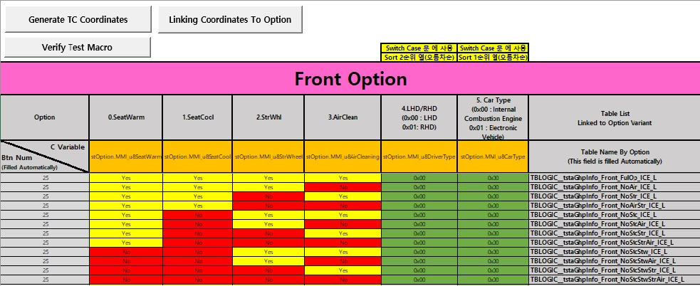
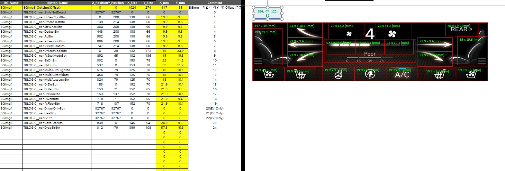
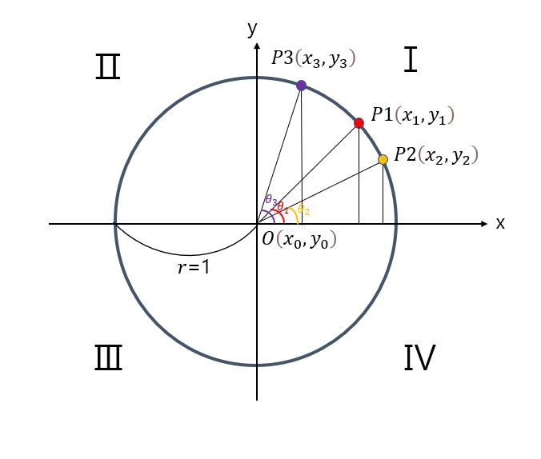
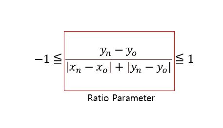

# Genesis G80(RG3), GV80(JX1)

## 1. Project Overview
- This project item is made of 3 parts: Panel controller, HVAC main controller, Rear controller
- 3 parts are connected by CAN protocol to communicate each other
- The panel controller is made of 3 functions: Screen Touch System, TFT LCD, Haptic
- I was in charge of the entire software development of the screen touch system

## 2. Development Environment
-  Real-Time based OS Software Platform
-  IDE: Visual Studio, Compiler: Green Hills
-  RH850F1L 64-bit Microprocessor | mXT449T(Screen Touch IC)

## 3. Challenging issues / Research and Solution / Result
This section demonstrates what was challenging issues, how to research them, and how to solve them

---
### Challenge #1 - Defining a specification(function, verification) of the touch screen system
Since this project was the first new project in our branch, there was not any guidance for the touch screen system

### Research and Solution #1
*(Step 1)* Searched a lot of academic materials relevant to the function and verification of the touch screen system 
*(Step 2)* Sorted out necessary information according to our project requirements 
*(Step 3)* Detailed all the functional elements of the touch screen system with functional safety requirements considered 
*(Step 4)* Finalized the specification with engineers of the cooperative company 
*(Step 5)* Verified functions of the touch screen system in a test laboratory with a robot arm machine 

### Result #1
Stabilized the functional requirements of the screen touch system and the verification process. the following presents the contents of the specification of the touch screen system. 

 
Fig.1) the functional specification of the touch screen system

---
### Challenge #2 - Automating time-consuming manual programming by creating a software tool
There were too many kinds of graphic images (more than 100) according to vehicle options and regions. Whenever a lot of graphic images are changed at customer's request, the touch coordinates were programmed manually at that time to match these graphic images with touch coordinates. It caused time-consuming programming and miss matched problem between the graphic images and the touch coordinates.

### Research and Solution #2
*(Step 1)* Formulated the algorithm that calculates the touch areas and the coordinates according to the graphic images. In **fig.3)**, by simply placing a rectangular box on a graphic image, it calculates coordinates of a specific touch region (a red rectangular box). And then input a name of the touch region and calculated coordinates in the left table 
*(Step 2)* Designed the function that links data structure used in software program with information of the touch area. In **fig.2)**, 'Generate TC Coordinates' button performs works that generate software programs in the form of *.h and *.c file 
*(Step 3)* Created the verification algorithm that checks overlapped touch areas, wrong connected data structure, and software program errors. In **fig.2)**, 'Linking coordinates To Option' button executes works that verify software programs and errors: overlapped touch areas, touch areas out of the range of entire graphic image, incorrectly connected data structure, invalid name of variables, same name of the data used in software programs 
*(Step 4)* Programmed all the functions and algorithms by utilizing VBA (Visual Basic Application) programming, automating software code generation 

 
Fig.2) Option setting page in the software tool

 
Fig.3) Coordinates generation page in the software tool

### Result #2
The solution #2 reduced the time spent on the manual programming works from a couple of days to one or so hours and improved the quality of software programs 

---
### Challenge #3 - Inventing the software algorithm that compensates for erroneously aligned physical coordinates
To provide a reliable touch system at a final production stage, I decided to compensate for misalignment of the
physical coordinates due to incorrect attachment of the touch screen sensor on a TFT LCD.

### Research and Solution #3
*(Step 1)* Designed the entire tuning process being employed in the final production stage 
*(Step 2)* Programmed the rotation matrix converting the misaligned physical coordinates into the normal ones 
*(Step 3)* Added service functions for production engineers to tune the parameters of the rotation matrix and to check the quality of the touch screen sensor 
*(Step 4)* Educated production engineers about the tuning and verification method 

### Result #3
The solution #2 reduced the time spent on the manual programming works from a couple of days to one or so hours and improved the quality of software programs 

---
### Challenge #4 - Programming gesture algorithms
We needed to satisfy our customer requirements for gesture functions such as rotation, flicker and drag. Especially when implementing the algorithm of the rotary gesture, an object’s high moving speed and coordinate jitter caused several errors in calculating the total distance and direction (clock wise or counter clock wise) of an object.

### Research and Solution #4
When calculating angle values with C language, we can use an arctan(x) function in the math library. However, the usage of the arctan(x) function will cause an delay in operation time of Microprocessors. In embedded system having limited resources, the time management of software task period is very important. Thus, I introduced simple an equation that does not use  the arctan(x)

*(Step 1)* Defined specifications of the several gestures including the moving speed of an object 
*(Step 2)* Designed the software modules of the gestures: logic flow chart, state machine, module dependency, data structure, tuning parameters 
*(Step 3)* Created the algorithm that calculates the angle of a current position of the rotary gesture in a defined graphic region by using coordinates, a center position, and quadrant 
*(Step 4)* Devised the algorithm detecting the rotation direction of an object by employing a rotation speed, a moving tendency, and a previous direction of it 
*(Step 5)* Programmed these algorithms with C language and integrated them into software modules only to transfer the exact angle and direction of a rotary gesture to application modules 

 
Fig.4) Quadrants and Coordinates in 2-dimentional plane

**Fig.4)** shows 4 quadrants, a circle (radius = 1), angles, center position, and random coordinates of the first quadrant. When a point moves from P3 through P1 to P2, 𝜃n value will decrease(𝜃3 -> 𝜃1 -> 𝜃2), Xn and Yn values will increase(X3 -> X2-> X1) and decrease(Y3 -> Y2-> Y1) respectively. In this pattern, if we utlize a ratio of Xn and Yn according to 𝜃n, we can calculate 𝜃n. 

 
<b>Fig.5) the ratio property of Xn and Xy in the circle</b>

**Fig.5)** showes the ratio property of Xn and Xy. It means that the ratio of Xn and Xy are going to change according to the variation of 𝜃n.

Now, we can calculate angle values as the following pseudocode.

>(float) function f32AngleCalcuation(Xn, Yn, Xo, Yo) 
>{ 
&nbsp;&nbsp;&nbsp;&nbsp;(int) Delta_X; Delta_Y; Abs_X; Abs_Y; 
&nbsp;&nbsp;&nbsp;&nbsp;(folat) Offset; CalTemp; 

>&nbsp;&nbsp;&nbsp;&nbsp;Delta_X = Yn - Yo; 
&nbsp;&nbsp;&nbsp;&nbsp;Abs_X = Absolute(Delta_X); 
&nbsp;&nbsp;&nbsp;&nbsp;Delta_Y = Yn - Yo 
&nbsp;&nbsp;&nbsp;&nbsp;Abs_Y = Absolute(Delta_Y); 

>&nbsp;&nbsp;&nbsp;&nbsp;if(zero==(Abs_X + Abs_X)) 
&nbsp;&nbsp;&nbsp;&nbsp;{ 
&nbsp;&nbsp;&nbsp;&nbsp;&nbsp;&nbsp;&nbsp;&nbsp; Offset = 0.0f;  
&nbsp;&nbsp;&nbsp;&nbsp;} 
&nbsp;&nbsp;&nbsp;&nbsp;else 
&nbsp;&nbsp;&nbsp;&nbsp;{ 
&nbsp;&nbsp;&nbsp;&nbsp;&nbsp;&nbsp;&nbsp;&nbsp; Offset = (Delta_Y / (Abs_X + Abs_Y)); 
&nbsp;&nbsp;&nbsp;&nbsp;} 

>&nbsp;&nbsp;&nbsp;&nbsp;if (Delta_X < 0) 
&nbsp;&nbsp;&nbsp;&nbsp;{ 
&nbsp;&nbsp;&nbsp;&nbsp;&nbsp;&nbsp;&nbsp;&nbsp; CalTemp = 2.0f - Offset; 
&nbsp;&nbsp;&nbsp;&nbsp;} 
&nbsp;&nbsp;&nbsp;&nbsp;else if (Delta_Y < 0) 
&nbsp;&nbsp;&nbsp;&nbsp;{ 
&nbsp;&nbsp;&nbsp;&nbsp;&nbsp;&nbsp;&nbsp;&nbsp; CalTemp = 4.0f + Offset; 
&nbsp;&nbsp;&nbsp;&nbsp;} 
&nbsp;&nbsp;&nbsp;&nbsp;else 
&nbsp;&nbsp;&nbsp;&nbsp;{ 
&nbsp;&nbsp;&nbsp;&nbsp;&nbsp;&nbsp;&nbsp;&nbsp; //Nothing 
&nbsp;&nbsp;&nbsp;&nbsp;} 

>&nbsp;&nbsp;&nbsp;&nbsp; return (CalTemp * 90.0f); 
} 

Let's compare return values of this equation and values of arctan(x). 
**EX.1)** Let's suppose that X=1 and Y=1. The return value of the above function is going to 45deg and arctan(1/2) value is going to 45deg. 
**EX.2)** Let's suppose that X=2 and Y=1. The return value of the above function is going to 30deg and arctan(1/2) value is going to 26.5deg. 
**EX.3)** Let's suppose that X=1 and Y=4. The return value of the above function is going to 72deg and arctan(4/1) value is going to 75.9deg. 

### Result #4
The value of arctan(x) is more accurate than the return value of this function. However, the tolerance of (arctan(x) - the return value of this function) is ±5deg or so. If a rotary gesture does not need very much accurate angle value, this approach will provide simple and fast operation. This solution saved memory capacity used for lookup-talbe of arctan(x). 
___
