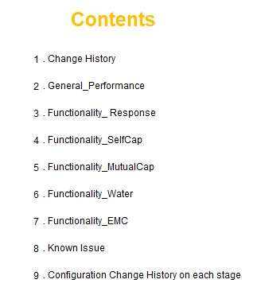

# Genesis G80(RG3), GV80(JX1)

## 1. Project Overview
- This project item is made of 3 parts: Panel controller, HVAC main controller, Rear controller
- 3 parts are connected by CAN protocol to communicate each other
- The panel controller is made of 3 functions: Screen Touch System, TFT LCD, Haptic
- I was in charge of the entire software development of the screen touch system

## 2. Development Environment
-  Real-Time based OS Software Platform
-  IDE: Visual Studio, Compiler(Green Hills)
-  RH850F1L 64-bit Microprocessor | mXT449T(Screen Touch IC)

## 3. Challenging issues / Research and Solution / Result
This section demonstrates what was challenging issues, how to research them, and how to solve them

### Challenge #1 - Defining a specification(function, verification) of the touch screen system
Since this project was the first new project in our branch, there was not any guidance for the touch screen system

### Research and Solution #1
*(Step 1)* Searched a lot of academic materials relevant to the function and verification of the touch screen system 
*(Step 2)* Sorted out necessary information according to our project requirements 
*(Step 3)* Detailed all the functional elements of the touch screen system with functional safety requirements considered 
*(Step 4)* Finalized the specification with engineers of the cooperative company 
*(Step 5)* Verified functions of the touch screen system in a test laboratory with a robot arm machine 

### Result #1
Stabilized the functional requirements of the screen touch system and the verification process. the following presents the contents of the specification of the touch screen system. 

 

Fig.1) the functional specification of the touch screen system

